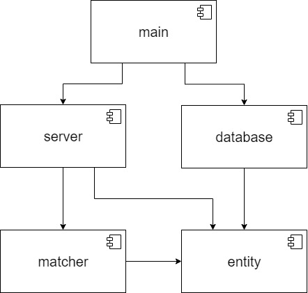
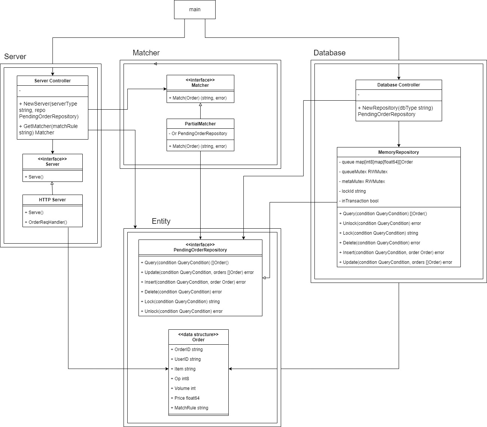

# Component Design
## Package Description
There are 4 packages and a main function
* **main**: Get a new server implementation from server package and get a new database implementation from database package then start the program and serving
* **server**: Including a Server interface and it's implementation HttpServer for receiving new order request from client. It can add any kind of server by implementing Server interface with a new protocol, e.g. gRPC, GraphQL... etc
* **entity**: Define a PendingOrderRepository interface for manipulating order data and a Order structure for order information
* **database**: Including MemoryRepository, an in simple memory database, implements PendingOrderRepository interface
* **matcher**: Matcher is a interface which receives an order and find match order of it. PartialMatcher is an implementation of Matcher interface, it realize a match rule I call it partial match. It can add any other match rule by implementing Matcher interface.
	* **partial match**: When a new order coming, partial match will find a pending order in opposite operation (if the new order is buy, opposite operation is sell) and substract quantity of both new order and pending. After substract, if new order's quantity become 0, then this match is finished. If pending order's quantity become 0, then get next pending order and repeat the process.
## Diagram
### The dependency diagram is as follow:

### A detailed dependency diagram:

The original diagram is in [draw.io](https://drive.google.com/file/d/1pbRN5alkWCrXtAtczcc5hVZW3bVV98q4/view?usp=sharing)